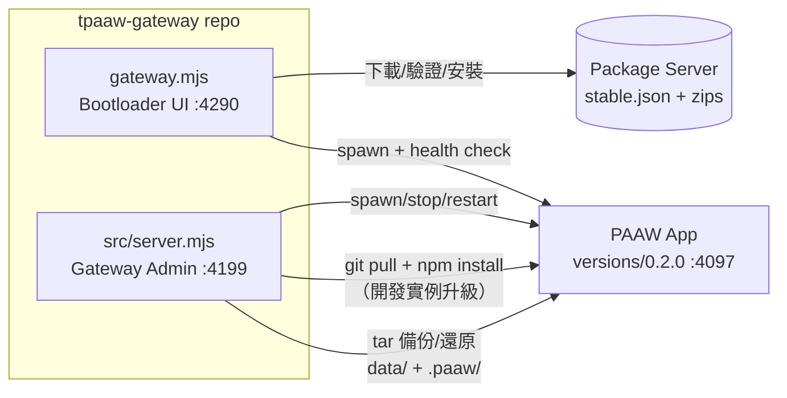

# tpaaw-gateway API Reference

## Feature 對照

本文件 endpoints 依 feature 歸屬：

- **F20260904-001 Gateway CLI Bootloader** — npm CLI 安裝/更新/啟動（非 HTTP）
- **F20260904-002 Gateway Dashboard Server** — 本文件所有 `/api/*` 認證、config endpoints（:4199）
- **F20260904-003 Gateway Backup & Restore** — `/api/backups*` 備份列表/建立/還原 endpoints


> 適用版本：tpaaw-gateway 0.1.x ｜ 更新日期：2026-09-05

本 repo 有**兩個獨立的 HTTP server**，用途不同：

| Server | 檔案 | 預設 Port | 用途 | 認證 |
|---|---|---|---|---|
| **Bootloader UI** | `gateway.mjs` | `PAAW_GW_PORT`（預設 4290） | 安裝 / 更新 / 啟停 PAAW app 本體 | 無（本機 UI） |
| **Gateway Admin** | `src/server.mjs` | `config.json` 的 `port`（預設 4199） | PAAW 開發實例的 DevOps 管理平台（進程、升級、備份、事件） | Bearer token（登入取得） |



---

## 1. Bootloader UI API（gateway.mjs，port 4290）

由 `npm start`（= `node gateway.mjs ui`）啟動。服務 gateway 自身的 dashboard 與安裝/更新作業。

**無認證** — 此 UI 綁定本機使用，所有操作走背景 job（一次只允許一個 job）。

### GET /
回傳 dashboard 頁面（`ui/index.html`）。

### GET /api/settings
查詢目前 gateway 設定值與來源。

**Response 200**
```json
{
  "packageServer": { "value": "http://192.168.8.189:4180", "source": "config", "envLocked": false },
  "paawHome": { "value": "/Users/me/my-paaw", "source": "cwd", "envLocked": false }
}
```
- `source`：`env`（環境變數鎖定）｜`config`（gateway.json）｜`default`／`cwd`
- `envLocked: true` 時，POST 無法覆蓋該設定

### POST /api/settings
更新 package server URL 與安裝路徑（寫入 `gateway.json`）。

**Request body**
```json
{ "packageServer": "http://192.168.8.189:4180", "paawHome": "/Users/me/my-paaw" }
```

**Response 200**
```json
{ "ok": true, "changed": ["packageServer"], "ignored": [], "home": "/Users/me/my-paaw", "packageServer": "http://192.168.8.189:4180" }
```

| 狀態碼 | 情境 |
|---|---|
| 400 | body 不是合法 JSON；packageServer 非 `http(s)://` 開頭；paawHome 非絕對路徑 |
| 409 | 有 job 執行中；或 PAAW 執行中欲改 `paawHome`（先停止） |

### GET /api/status
```json
{ "current": "0.2.0", "installed": ["0.1.0", "0.2.0"], "stable": "0.2.0", "running": true, "job": null }
```
（欄位由 `uiStatus()` 組合，包含版本與執行狀態）

### GET /api/log
```json
{ "lines": ["[job] update started", "download 0.2.0 ..."] }
```

### POST /api/update ｜ /api/start ｜ /api/stop ｜ /api/restart
觸發背景 job，**立即回應 202**，進度用 `GET /api/log` 輪詢。

**Response 202**
```json
{ "ok": true, "message": "更新已開始" }
```
- `409`：已有 job 執行中
- `restart` = stop（若有跑）+ start

---

## 2. Gateway Admin API（src/server.mjs，port 4199）

獨立管理平台（守護者角色），**不依賴 PAAW Server 運行**。設定來源為 repo 根目錄 `config.json`（可用 `PAAW_CONFIG` 覆蓋路徑）。

### 認證

除 public route 外，所有請求需帶 header：

```
Authorization: Bearer <token>
```

**Public routes**（免認證）：`POST /api/auth/login`、`GET /api/health`、`/`（dashboard 頁面）、`/assets/*`

Token 由 login 取得，存在**記憶體** session Map，效期 `sessionMaxAge`（預設 86400000 = 24 小時；server 重啟即失效）。

### POST /api/auth/login
**Request body**
```json
{ "userId": "admin", "password": "changeme" }
```

**Response 200**
```json
{ "token": "3f8a...-uuid", "user": { "id": "admin", "name": "Fleming", "role": "admin" } }
```

**Response 401** `{ "error": "Invalid credentials" }`

> ⚠️ 帳號密碼定義在 `config.json` 的 `users[]`。目前為明文比對，部署前請改用 hash —— 見 README「安全注意事項」。

### GET /api/auth/me
回傳目前 token 對應的使用者。
```json
{ "id": "admin", "name": "Fleming", "role": "admin" }
```

### GET /api/health（public）
```json
{ "status": "ok", "gateway": true, "uptime": 3612, "version": "0.1.0" }
```

### GET /api/dashboard
一次取回整個 dashboard 狀態：`{ system, health, version, git, backups, events }`。

```json
{
  "system": { "nodeVersion": "v20.11.0", "platform": "darwin", "pid": 12345, "uptime": 7200,
              "memory": { "rss": "88 MB", "heapUsed": "21 MB", "heapTotal": "42 MB" },
              "paawServer": { "status": "running", "pid": 12346, "uptime": 3600, "restartCount": 0 },
              "version": "0.2.0",
              "git": { "branch": "main", "commit": "a1b2c3d", "date": "2026-09-04 16:00:00 +0800", "dirty": false, "behind": 0 } },
  "backups": { "total": 5, "latest": "paaw-backup-2026-09-04-03.tar.gz" },
  "events": [ { "id": "…", "ts": "2026-09-04T19:03:00.000Z", "type": "backup_done", "detail": "Backup created: …", "userId": "admin" } ]
}
```

### GET /api/version
```json
{ "current": "0.2.0",
  "git": { "branch": "main", "commit": "a1b2c3d", "dirty": false, "behind": 2 },
  "latest": "v0.3.0" }
```
`behind` = 落後 origin 的 commit 數；`latest` 來自 remote tags。

### POST /api/upgrade（admin）
開發實例升級流程：若 PAAW 在跑先 stop → `git stash` → `git pull` → `npm install` → restart。

**Response 200**
```json
{ "ok": true, "steps": ["git stash ✓", "git pull ✓", "npm install ✓", "restarted ✓"], "version": "0.3.0" }
```
失敗時 `{ "ok": false, "error": "…", "steps": [已完成步驟] }`。每步驟寫入事件日誌（`upgrade_start` / `upgrade_done` / `upgrade_failed`）。

### POST /api/server/start ｜ /api/server/stop ｜ /api/server/restart（admin）
管理 PAAW Server 進程（`config.paawServerCmd`，於 `paawRoot` 下 spawn）。

```json
{ "ok": true, "status": "running", "pid": 12346 }
```

### GET /api/backups
```json
{ "backups": [
  { "filename": "paaw-backup-2026-09-04-03.tar.gz", "date": "2026-09-04 03:00", "size": 1048576, "sizeMB": "1.0" }
] }
```
依時間新→舊排序。檔名格式固定為 `paaw-backup-YYYY-MM-DD-HH.tar.gz`（regex 驗證，防 path traversal）。

### POST /api/backups/create
手動建立備份：`tar czf` 打包 `PAAW_ROOT` 下的 `data/` 與 `.paaw/`，超過 `maxBackups`（預設 7）自動刪最舊。

**Response 200**
```json
{ "ok": true, "filename": "paaw-backup-2026-09-05-00.tar.gz", "size": 1048576 }
```
失敗 `{ "ok": false, "error": "…" }`。

### POST /api/backups/restore/:filename
還原備份。流程：**停止 PAAW → 先建一份 safety 備份 → tar 解開 → 重啟 PAAW**。

```
POST /api/backups/restore/paaw-backup-2026-09-04-03.tar.gz
```

**Response 200** `{ "ok": true }`

| 狀態碼 | 情境 |
|---|---|
| 400 | 檔名不符 `paaw-backup-YYYY-MM-DD-HH.tar.gz` 格式（regex 擋下，不接受路徑字元） |
| 404 | 備份檔不存在 |

### GET /api/events?limit=50
事件日誌（audit trail），新→舊。
```json
{ "events": [ { "id": "uuid", "ts": "ISO-8601", "type": "login", "detail": "User Fleming logged in", "userId": "admin" } ] }
```
事件類型：`login`、`backup_start/done/failed`、`restore_start/done/failed`、`upgrade_start/done/failed`、`server_started`、`paaw_started/stopped/crashed` 等。記憶體保留最近 500 筆，全部以 JSONL 追加寫入 `PAAW_EVENT_LOG`（預設 `src/../events.jsonl`）。

### GET /api/users（admin）
```json
{ "users": [ { "id": "admin", "name": "Fleming", "role": "admin" } ] }
```
（不回傳密碼欄位）

---

## 3. config.json（Admin server 設定）

路徑：repo 根目錄 `config.json`（`PAAW_CONFIG` 可覆蓋）。不存在時使用內建預設值。

| 欄位 | 預設 | 說明 |
|---|---|---|
| `port` | `4199` | Admin server port |
| `paawRoot` | `../../../`（相對 src/） | PAAW repo 根目錄（開發實例） |
| `paawServerCmd` | `node packages/server/src/index.mjs` | PAAW 啟動指令 |
| `paawServerPort` | `4097` | PAAW Server port（health check 用） |
| `backupDir` | `<paawRoot>/backups` | 備份檔目錄 |
| `backupSchedule` | `0 3 * * *` | 排程備份（cron 語法，每天 03:00） |
| `maxBackups` | `7` | 保留份數，超過刪最舊 |
| `autoStartPaaw` | `false` | gateway 啟動時自動帶起 PAAW |
| `users[]` | 見下 | `{ id, name, role, passwordHash }` |
| `sessionSecret` | — | session 簽章 |
| `sessionMaxAge` | `86400000` | token 效期（ms） |

### 環境變數（測試隔離用）

| 變數 | 覆蓋目標 |
|---|---|
| `PAAW_CONFIG` | config 檔路徑 |
| `PAAW_ROOT` | PAAW 根目錄 |
| `PAAW_BACKUP_DIR` | 備份目錄 |
| `PAAW_EVENT_LOG` | 事件日誌檔路徑 |
| `PAAW_MAX_BACKUPS` | 最大保留份數 |

> 這些 knob 主要供單元/e2e 測試指向 temp dir，避免污染開發者本機正在跑的 gateway（見 `tests/`）。

---

## 4. 測試

```bash
npm test    # = node --test tests/**/*.test.mjs
```

| 測試 | 檔案 | 重點 |
|---|---|---|
| Unit | `tests/unit/backup.test.mjs` | backup 建立/輪替/還原、regex 驗證（mkdtemp 隔離 + ESM cache-bust import） |
| E2E | `tests/e2e/gateway-backup-auth.test.mjs` | spawn 真 server 子進程：login/auth flow、backup API、孤兒進程防護（隨機 port，不碰 :4199） |
